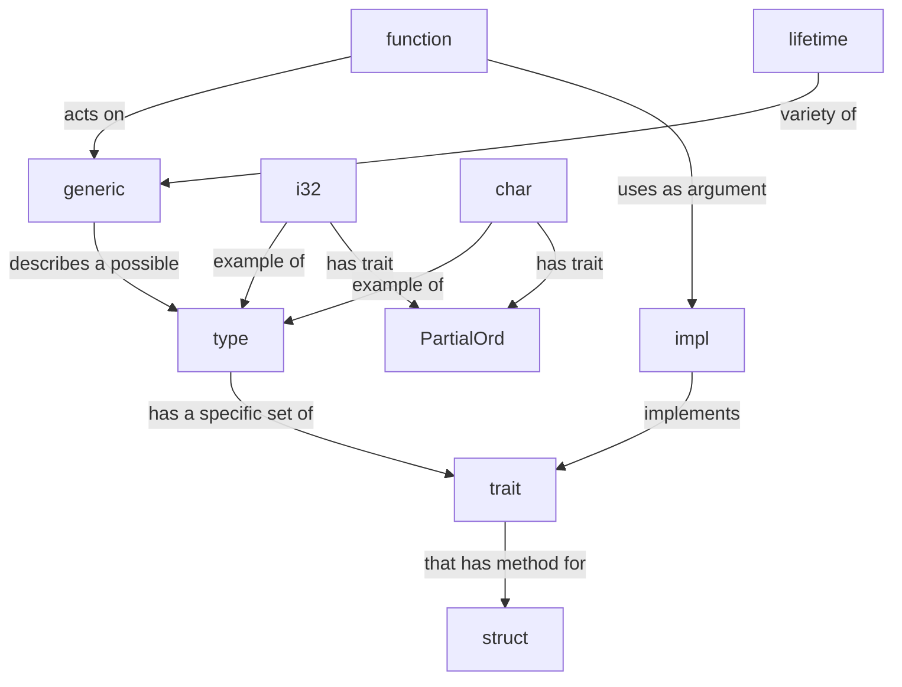

## Generics Traits and Lifetimes

```mermaid
flowchart TD
    function
    generic
    type
    trait
    impl
    struct
    lifetime
    i32
    char
    ex1["PartialOrd"]
    function -->|acts on| generic
    lifetime -->|variety of| generic
    type -->|has a specific set of| trait
    trait -->|that has method for| struct
    function -->|uses as argument| impl
    impl -->|implements| trait
    generic -->|describes a possible| type
    i32 -->|example of| type
    char -->|example of| type
    i32 -->|has trait| ex1
    char -->|has trait| ex1
```

